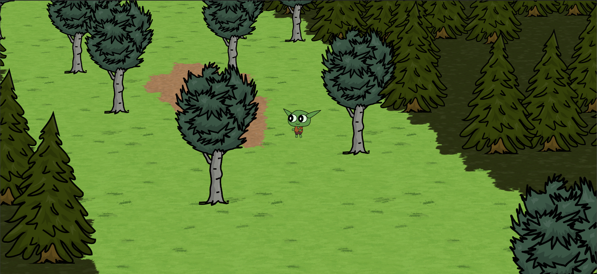
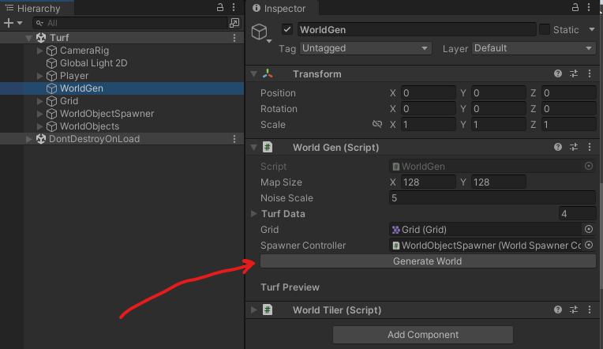
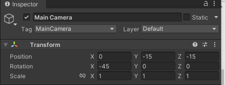
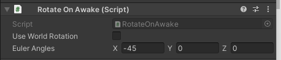
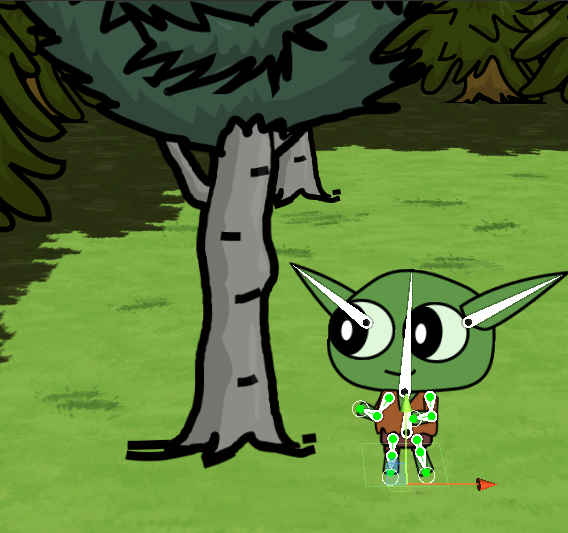
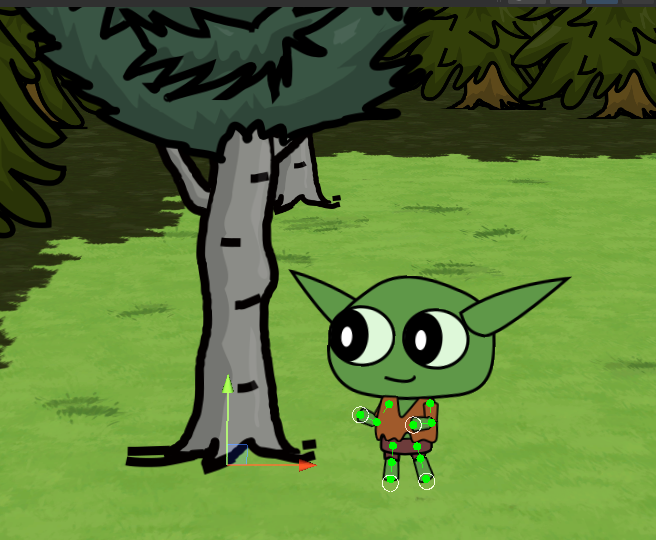
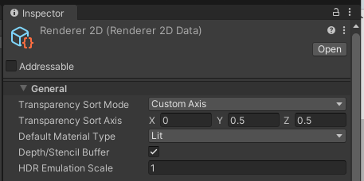

# Welcome

This repo contains an example project showing how to use Unity tilemaps in a new way.

> Obviously there are no Don't Starve assets in this repo, that would be illegal.

>The assets that are in this repo are yours to use though.

To get started open the Turf scene.

To generate a new world use the WorldGen gameObject.

 
 

# Tips on setting up a new scene

## Camera setup:

A rotation of -45 feels good here, to zoom in and out change the y and z position values in lock step.

## Sprite setup:

Sprites need to be rotated towards the camera, here I have a RotateOnAwake on every sprite in the scene.

For sorting to work make sure the game objects pivot point is at the bottom:

In your Renderer2D settings use the drop down to set Transparency Sort Mode to Custom Axis, then set the Transparency Sort Axis to (0, 0.5, 0.5)

